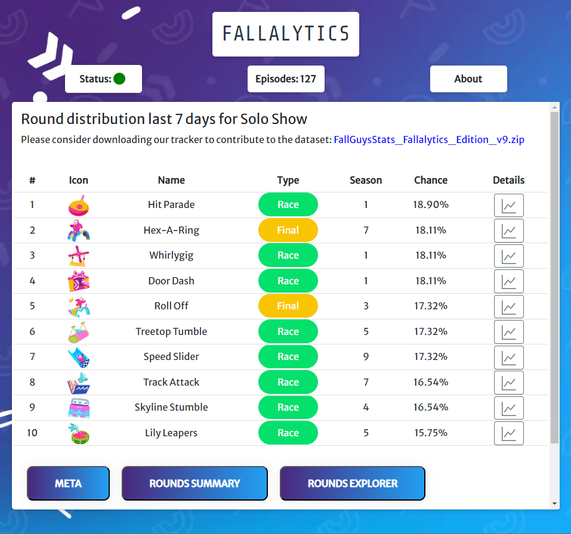

# Fallalytics
[](https://github.com/Hoier/Fallalytics/blob/main/LICENSE)
Welcome to the public repo for the front-end of [Fallalytics](https://fallalytics.com).
Fallalytics is a website that keeps track of round distribution in [Fall Guys](https://fallguys.com).

Fallalytics is built on Node > v18, with Express and the Pug renderer. The data is pulled from a MongoDB server.





## Installation

In order to run this locally, you must have the community server from [MongoDB](https://www.mongodb.com/try/download/community) installed and running without UAC. You must also have [Node v18](https://nodejs.org/en/download).

```bash
  git clone https://github.com/Hoier/Fallalytics.git
  cd fallalytics
  npm install
```

## Running locally

To run Fallalytics locally use the dev script to automatically rebuild/start when any changes to files are detected:

```bash
  npm run dev
```
You can now open you browser at localhost:8000 to view the UI.

If you want your browser to automatically update on changes, open a seperate terminal after running the dev script, and run:
```bash
  npm run ui
```
Running the command above should automatically open a browser at localhost:3000 which will automatically refresh on new builds.

If you have any issues with building, you might not have set up MongoDB correctly.
## Environment Variables

To run this project, you will not need to add any environment variables. The production environment uses the following

`DEPLOYMENT` String to check if installation is prod.

`MONGODB_URL` Url to the MongoDB.

`FALLGUYSDB_URL` URL to get show names.

`FALLGUYSDB_TOKEN` API key to get show names.

## Contributing

Contributions are always welcome!

We are spessifically looking for improvements to the front-end UI/UX, especially in the mobile department. 

Localizing the site would also be great.

